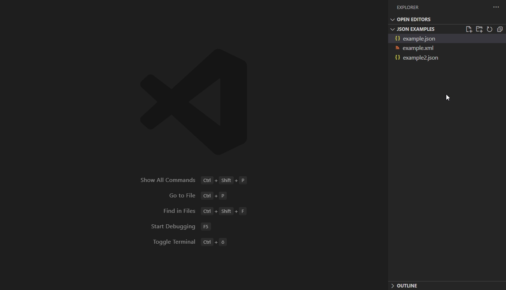

# json-grid-viewer
Cloned from dutchigor:json-grid-viewer, this extension allows you get a better overview of the content in a JSON file by showing it in a resizable grid.
- Columns are resizable.
- Each object and array is collapsed by default but can be expanded to see all contents
- Arrays of objects show in a table format

## Demo


## Usage
To open a json file in the grid viewer, right click the file, select *Open With... > JSON Grid*. The grid is read only but will display any changes made to the json file live, provided the json is valid.

## To do:
- Add editing capabilities
- Take colours from the active theme

## Build Extension
```
npm install
npm run build
npm run vscode:prepublish
vsce package
```

## Note:
- as of Node 20.5.1, consider "export NODE_OPTIONS=--openssl-legacy-provider" before run "npm build", to avoid "Error: error:0308010C:digital envelope routines::unsupported".
- watchout .vscodeignore and use "vsce ls" to check files that will be included in the final package.
